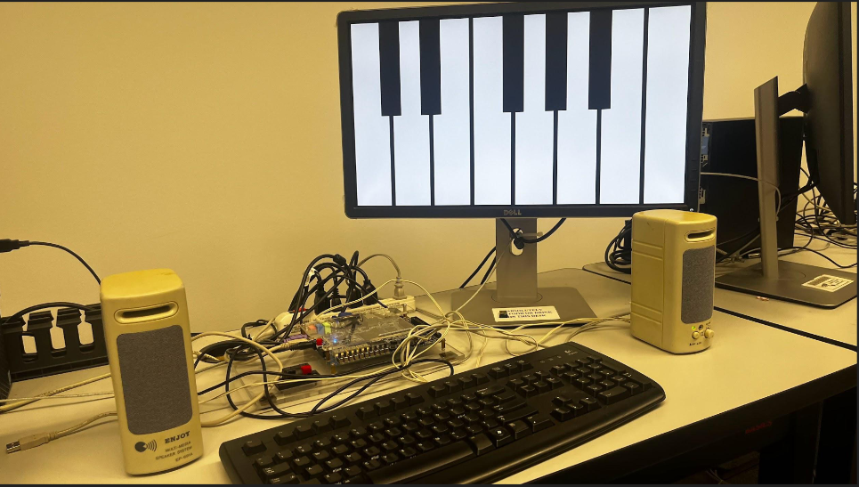

# De1-SoC-Piano
This project utilizes a De1-Soc FPGA board, alongside a PS/2 keyboard, a VGA display, and any form of audio output device to create a fully functioning piano.
The piano allows users to play 13 available keys at 2 different octaves.
The piano also includes a 10 second recording feature where users can play back recorded inputs.

